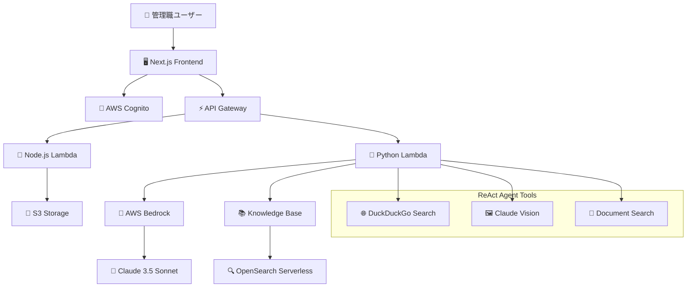

# AI Management Assistant

次世代マネジメント支援AIアシスタント - 管理職の意思決定支援とビジネス効率化を実現

## ✅ 主要機能

- ✨ **モダンなUI/UX** - Tailwind CSS + shadcn/ui による洗練されたインターフェース
- 💬 **インテリジェントチャット** - ReActエージェントによる高度な対話機能
- 🔍 **Web検索統合** - DuckDuckGoを活用したリアルタイム情報収集
- 📚 **社内文書検索** - Knowledge Baseによる組織内情報へのRAG検索
- 🖼️ **マルチモーダル画像認識** - Claude Visionによる画像・チャート・文書の自動解析
- 📎 **ファイルアップロード** - 画像・PDF・文書ファイルの処理とS3保存
- 🔐 **セキュア認証** - AWS Cognito + JWTによる企業レベル認証システム
- 📱 **レスポンシブデザイン** - デスクトップ・タブレット・モバイル対応
- 🏗️ **エンタープライズインフラ** - AWS サーバーレスアーキテクチャ

## 🎯 **プロジェクト完成度: 85%**

| 機能 | 状態 | 詳細 |
|------|------|------|
| 🎨 **フロントエンド** | ✅ **完成** | モダンUI・認証・ファイルアップロード |
| 🔐 **認証・セキュリティ** | ✅ **完成** | Cognito + JWT・権限管理 |
| 🤖 **ReActエージェント** | ✅ **完成** | Web検索・RAG・画像認識 |
| 🖼️ **マルチモーダルAI** | ✅ **完成** | Claude Vision統合・自動解析 |
| ⚡ **API・インフラ** | ✅ **完成** | Lambda・API Gateway・S3 |
| 📊 **ストリーミング** | 🔄 **予定** | リアルタイム応答表示 |
| 🚀 **本番最適化** | 🔄 **準備中** | モニタリング・CI/CD |

## 🏢 対象ユーザー

**企業の管理職**（部長、課長、チームリーダー）
- 戦略的意思決定支援
- 業務効率化とプロセス最適化  
- チーム管理とコミュニケーション
- データ分析と レポート作成支援

## 🚀 技術スタック

### フロントエンド
- **フレームワーク**: Next.js 14 (App Router), TypeScript
- **UI/UX**: Tailwind CSS, shadcn/ui, Radix UI
- **状態管理**: React hooks, Context API
- **認証**: AWS Amplify + Cognito統合

### バックエンド
- **インフラ**: AWS Serverless (Lambda + API Gateway)
- **IaC**: Terraform + Serverless Framework
- **認証**: AWS Cognito (ユーザープール + グループ管理)
- **ストレージ**: Amazon S3 (暗号化対応)
- **AI/ML**: AWS Bedrock (Claude 3.5 Sonnet), OpenSearch Serverless

### 開発・運用
- **言語**: TypeScript, Python 3.11, Node.js 18+
- **CI/CD**: GitHub Actions (準備中)
- **モニタリング**: CloudWatch, AWS X-Ray
- **セキュリティ**: エンタープライズレベル (詳細は[SECURITY.md](./SECURITY.md)参照)
  - JWT認証 + Cognito UserPool
  - S3暗号化 (AES-256)
  - IAM最小権限ポリシー
  - セキュア環境変数管理

## 🎯 アーキテクチャ概要



## 🛠️ 開発環境セットアップ

### 前提条件
- Node.js 18+ & npm 8+
- Python 3.11+
- AWS CLI設定済み
- Terraform 1.0+

### フロントエンド開発
```bash
# パッケージインストール
npm install

# 環境変数設定
cp .env.local.example .env.local
# .env.localに必要な値を設定

# 開発サーバー起動
npm run dev

# 型チェック・リント
npm run typecheck
npm run lint

# ビルド
npm run build
```

### バックエンド開発
```bash
# インフラデプロイ
cd backend/terraform
terraform init
terraform apply

# Lambda関数デプロイ
cd ../serverless
npm install
npx serverless deploy --stage dev

# Python依存関係
cd ../lambda/python
pip install -r requirements.txt
```

## 📁 プロジェクト構造

```
/home/ubuntu/GENAI/
├── src/                          # フロントエンド (Next.js)
│   ├── app/                      # Next.js App Router
│   ├── components/               # UIコンポーネント
│   │   ├── auth/                # 認証関連
│   │   ├── chat/                # チャット機能
│   │   ├── layout/              # レイアウト
│   │   └── ui/                  # 基本UIコンポーネント
│   ├── contexts/                # React Context
│   ├── lib/                     # ユーティリティ・API
│   └── types/                   # TypeScript型定義
├── backend/                     # バックエンド
│   ├── terraform/               # インフラ定義 (IaC)
│   ├── serverless/             # Serverless Framework
│   └── lambda/                 # Lambda関数
│       ├── nodejs/             # Node.js Lambda
│       └── python/             # Python Lambda (ReAct Agent)
└── docs/                       # ドキュメント
```

## 🔧 主要コマンド

```bash
# フロントエンド
npm run dev           # 開発サーバー
npm run build         # プロダクションビルド
npm run typecheck     # TypeScript型チェック
npm run lint          # ESLint実行

# バックエンド
./backend/deploy.sh dev    # 全体デプロイ
terraform apply            # インフラのみ
serverless deploy          # Lambda関数のみ
```

## 🚀 デプロイメント

1. **インフラ**: Terraformによる宣言的インフラ管理
2. **Lambda関数**: Serverless Frameworkによる関数デプロイ
3. **フロントエンド**: AWS Amplify (準備中)

## 📊 モニタリング

- **ログ**: CloudWatch Logs
- **メトリクス**: CloudWatch Metrics  
- **トレーシング**: AWS X-Ray
- **アラート**: CloudWatch Alarms

## 🚀 クイックスタート

### 1. リポジトリクローン
```bash
git clone <repository-url>
cd GENAI
```

### 2. 環境設定
```bash
# フロントエンド依存関係
npm install

# 環境変数設定
cp .env.local.example .env.local
# .env.localに必要な値を設定（詳細はSECURITY.md参照）
```

### 3. 開発サーバー起動
```bash
npm run dev
# http://localhost:3000 でアクセス
```

### 4. バックエンドデプロイ（オプション）
```bash
# AWSクレデンシャル設定後
./backend/deploy.sh dev
```

## 🔒 セキュリティ

**⚠️ 重要**: 本番環境では [SECURITY.md](./SECURITY.md) の指示に従ってください

### 実装済みセキュリティ機能
- ✅ **JWT認証** + Cognito UserPool
- ✅ **IAM最小権限**ポリシー
- ✅ **S3暗号化** (AES-256)
- ✅ **CORS適切設定**
- ✅ **環境変数分離**
- ✅ **包括的な.gitignore**

### 本番環境での追加対応必要
- 🔧 JWT署名検証の実装
- 🔧 SSMパラメータの実際値設定
- 🔧 VPC内Lambda実行（推奨）

## 📄 ライセンス

MIT License - 詳細は`LICENSE`ファイルを参照